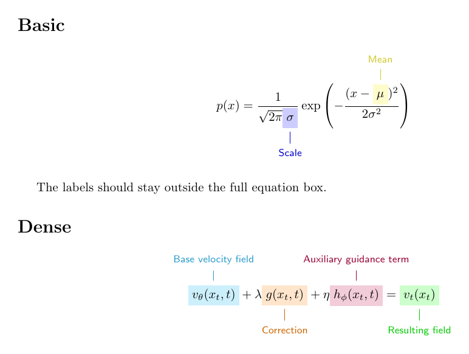
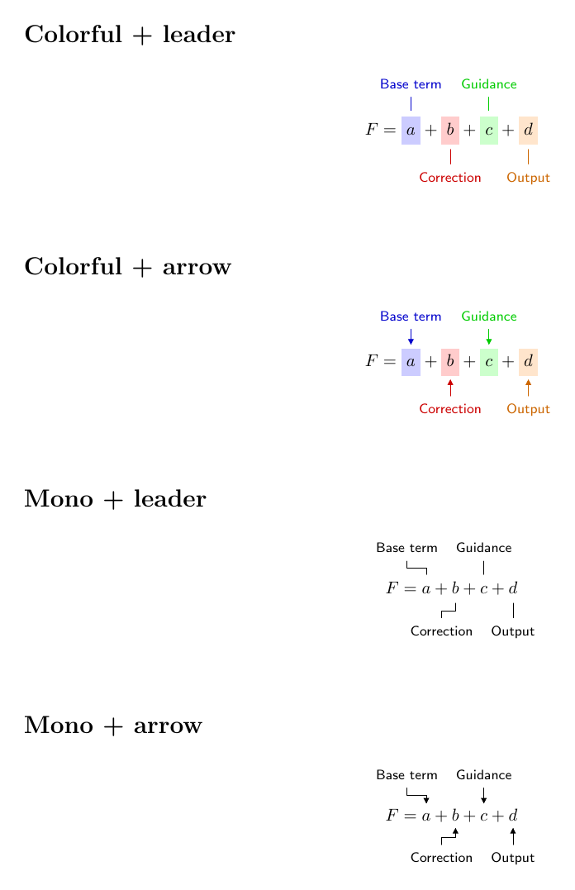

# EqAnnotate

**Declarative equation annotations with automatic layout for LaTeX.**

> Tell EqAnnotate what to label, not where to put the label.

EqAnnotate is a low-configuration LaTeX package for annotated display equations. Mark a mathematical term, declare its label, and let the package handle placement, spacing, de-overlap, column bounds, lane allocation, and connector routing.

```latex
\begin{annotatedequation}
p(x)=
\frac{1}{\sqrt{2\pi}\eqmark[blue]{sigma}{\sigma}}
\exp\left(-\frac{(x-\eqmark[yellow]{mu}{\mu})^2}{2\sigma^2}\right)

\eqannotate{mu}{Mean}
\eqannotate{sigma}{Scale}
\end{annotatedequation}
```

<p align="center">
  
</p>

## Why EqAnnotate?

TikZ-based equation annotations are flexible, but that flexibility also makes the caller solve a 2D layout problem: anchors, offsets, lanes, and connector paths. EqAnnotate makes the common path declarative.

```latex
\eqmark[blue]{velocity}{v_\theta(x,t)}
\eqannotate{velocity}{Velocity field}
```

The automatic solver measures the equation and labels, chooses above/below placement, respects the active `\linewidth`, performs bounded horizontal de-overlap, opens extra lanes only when needed, reserves vertical space, and routes connectors outside the formula.

For difficult cases, a manual escape hatch remains available:

```latex
\eqannotatemanual[xshift=12mm,yshift=10mm][bend right=18]
  {velocity}{Velocity field}
```

## Install

### Overleaf

Upload `eqannotate.sty` to the project root and add:

```latex
\usepackage{eqannotate}
```

### Local project

Copy `eqannotate.sty` next to `main.tex` and use the same `\usepackage{eqannotate}` line.

See [Installation](docs/installation.md) for a user-wide TeX Live install and the optional agent skill.

## Compile

EqAnnotate uses TikZ remembered positions and `.aux`-based space reservation, so several TeX runs can be required on a fresh document. The easiest route is:

```bash
latexmk -pdf main.tex
```

With `pdflatex`, `lualatex`, or `xelatex` directly, rerun until EqAnnotate no longer asks for another pass.

## Core API

```latex
\eqmark[<color>]{<id>}{<math>}

\eqannotate{<id>}{<label>}
\eqannotate[prefer=above]{<id>}{<label>}
\eqannotate[prefer=below]{<id>}{<label>}

\eqannotatecolortheme{colorful} % or mono
\eqannotatecalloutstyle{leader} % or arrow
```

<p align="center">
  
</p>

Supported display wrappers in v0.1:

```text
annotatedequation
annotatedalign
annotatedgather
annotatedmultline
```

Each accepts optional `[numbered]`. `annotatedalign` and `annotatedgather` use one number for the whole block; `annotatedmultline` follows amsmath `multline`'s one-number model.

See the [User Guide](docs/usage.md) for numbering, multi-line equations, manual fallback, themes, warnings, and limitations.

## Automatic layout features

- equation- and term-aware above/below placement;
- real label measurement and automatic long-label wrapping;
- dynamic lane heights;
- active-column / local-`\linewidth` bounds;
- bounded horizontal de-overlap before opening new lanes;
- order-aware relaxation to reduce leader crossings;
- separated routing micro-tracks for dense callouts;
- vertical space reservation for automatic **and manual** annotations;
- connector masking behind annotation labels;
- independent `colorful` / `mono` and `leader` / `arrow` style axes.

## Manual fallback

```latex
\eqannotatemanual[<label TikZ options>][<to-path options>]
  {<id>}{<label>}
```

Manual annotations still inherit the current theme/callout style and reserve article space. They deliberately bypass automatic collision avoidance, column clamping, lane assignment, and crossing optimization.

## Compatibility

The current release candidate has been exercised with:

- pdfLaTeX and LuaLaTeX full regression suites;
- selected XeLaTeX coverage and `unicode-math`;
- `IEEEtran`, `acmart`, `revtex4-2`, `elsarticle`, and `beamer`;
- single-column, two-column, `fleqn` / `leqno`, `hyperref` / `cleveref`, and local-width contexts;
- full article-flow fixtures with prose, floats, references, page boundaries, automatic placement, and manual fallback.

See [Compatibility Results](tests/compatibility/RESULTS.md) and the [RC Audit](docs/rc-audit.md).

## v0.1 boundaries

EqAnnotate v0.1 intentionally does **not** implement:

- inline-math annotations;
- native per-row numbering semantics of `align` / `gather`;
- arbitrary custom `\tag` behavior;
- `\intertext` / `\shortintertext` inside EqAnnotate multi-line wrappers;
- automatic detection of non-white page backgrounds.

For non-white pages, set `\eqannotatebackgroundcolor` to the page color.

## Optional AI-agent skill

The repository includes a small optional skill at [`skills/eqannotate/SKILL.md`](skills/eqannotate/SKILL.md). It teaches coding/writing agents to prefer EqAnnotate's declarative automatic path, compile to convergence, and use manual placement only as a fallback rather than inventing raw TikZ coordinates.

EqAnnotate itself has no AI, network, Python, or API dependency.

## Related work

- [`annotate-equations`](https://github.com/st--/annotate-equations) provides convenient TikZ-based primitives for manually positioned equation annotations.
- [`ScholarPhi`](https://github.com/allenai/scholarphi) includes reader-side automatic equation diagrams and is useful engineering prior art for separating label measurement, placement, and leader routing.

EqAnnotate focuses on **author-side LaTeX source** with a deliberately constrained declarative API, automatic self-layout, and a manual fallback.

## Development

```bash
./tests/run.sh
./tests/compatibility/run.sh
```

Both suites require layout convergence rather than merely surviving a fixed number of TeX passes.

## License

MIT. See [LICENSE](LICENSE).
