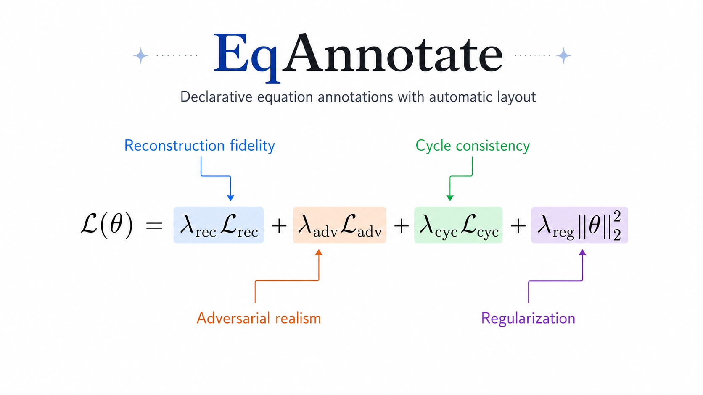
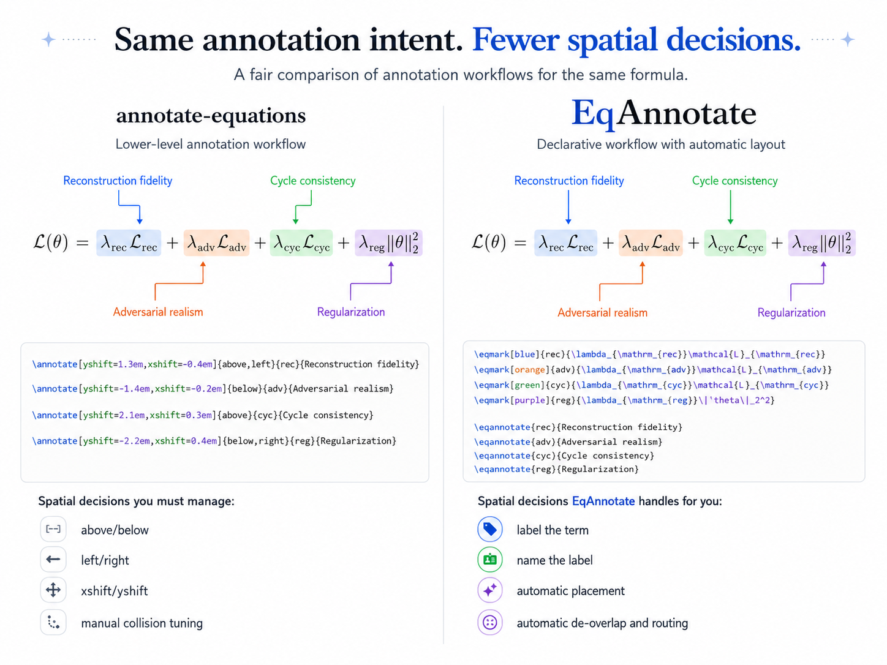

# EqAnnotate

[English](README.md) | 简体中文

[](https://github.com/intelland/eqannotate/actions/workflows/ci.yml)
[](https://github.com/intelland/eqannotate/releases/latest)
[](LICENSE)

**面向 LaTeX 的声明式公式标注与自动布局工具。**

> 告诉 EqAnnotate 要标注什么，而不是标签应该放在哪里。

EqAnnotate 用于为行间公式添加说明标注。你只需标记公式中的目标项并写出标签内容，package 会自动处理标签位置、换行、间距、避让、分层和连接线走向。

<p align="center">
  
</p>

EqAnnotate 让源码保持在数学语义层面，同时自动安排一组更密集的公式标注。

```latex
\begin{annotatedequation}
\mathcal{L}(\theta)
=
\eqmark[blue]{rec}{\lambda_{\mathrm{rec}}\mathcal{L}_{\mathrm{rec}}}
+
\eqmark[orange]{adv}{\lambda_{\mathrm{adv}}\mathcal{L}_{\mathrm{adv}}}
+
\eqmark[green]{cyc}{\lambda_{\mathrm{cyc}}\mathcal{L}_{\mathrm{cyc}}}
+
\eqmark[purple]{reg}{\lambda_{\mathrm{reg}}\|\theta\|_2^2}

\eqannotate{rec}{Reconstruction fidelity}
\eqannotate{adv}{Adversarial realism}
\eqannotate{cyc}{Cycle consistency}
\eqannotate{reg}{Regularization}
\end{annotatedequation}
```

## 同样的标注意图，更少的空间决策

<p align="center">
  
</p>

[`annotate-equations`](https://github.com/st--/annotate-equations) 提供了成熟而方便的 TikZ 公式标注工作流，也是 EqAnnotate 最直接的基础。EqAnnotate 在此基础上把常见使用方式再向上抽象一层：调用者主要声明“标哪一项、写什么说明”，placement、换行、避让、lane、column 边界和 connector routing 交给布局器处理。

区别不只是少写几个参数，而是调用者需要参与的空间决策更少。这个对比关注抽象层次：手动 primitives 会暴露 placement 选择，而 EqAnnotate 让常用途径保持声明式。
## 对作者和 Agent 的意义

对作者而言，更少的坐标微调意味着更短、更容易维护的 LaTeX 源码，也让整篇文档的标注风格更一致。

对 Codex、Claude Code 等 coding/writing agent 而言，识别“哪个项重要”“它表示什么”“标签该怎么写”属于语义和符号结构任务；持续调节 `xshift`、`yshift`、anchor、lane 与 routing 则是脆弱的二维视觉任务。EqAnnotate 将后者交给布局 solver。

> 在通常用法中，人和 agent 都只说明一个公式项的含义；EqAnnotate 决定标注放在哪里。

仓库内的 [Agent Skill](skills/eqannotate/SKILL.md) 会引导 agent 优先使用自动布局、编译至收敛，并只在困难公式中使用手动路径。package 本身仍是纯 LaTeX/TikZ，不依赖模型或 API。

## 安装

### Overleaf 或本地项目

1. 从[最新 GitHub Release 下载 `eqannotate.sty`](https://github.com/intelland/eqannotate/releases/latest/download/eqannotate.sty)。
2. 将文件上传或复制到 `main.tex` 所在目录。
3. 正常加载：

```latex
\usepackage{eqannotate}
```

更多安装方式见[安装说明](docs/installation.md)，完整用法见[用户指南](docs/usage.md)。

## 核心接口

```latex
\eqmark[<color>]{<id>}{<math>}
\eqannotate[prefer=auto|above|below]{<id>}{<label>}

\eqannotatecolortheme{colorful} % 或 mono
\eqannotatecalloutstyle{leader} % 或 arrow
```

支持 `annotatedequation`、`annotatedalign`、`annotatedgather` 和 `annotatedmultline` 四种行间公式环境，每种都可使用可选的 `[numbered]`。

自动路径负责测量、换行、列宽适配、标签避让、连接线与正文留白。若某个公式确实需要精确控制，可以只对它使用手动接口：

```latex
\eqannotatemanual[xshift=12mm,yshift=10mm][bend right=18]
  {velocity}{速度场}
```

## Roadmap

- [ ] 行内公式标注
- [ ] 更丰富的多行编号
- [ ] 自定义 `\tag`
- [ ] 多行环境中的 `\intertext` / `\shortintertext`
- [ ] 更好的非白色背景处理
- [ ] CTAN 发布

当前若使用彩色页面，请将 `\eqannotatebackgroundcolor` 设置为页面颜色。

## 文档

- [安装说明](docs/installation.md)
- [用户指南](docs/usage.md)
- [公开 API 合约](docs/api-contract.md)
- [布局设计](docs/layout.md)
- [验证说明](docs/validation.md)

## 致谢

EqAnnotate 直接建立在 [`annotate-equations`](https://github.com/st--/annotate-equations) 展示的公式标注工作流与 TikZ 技术之上，并在其上加入低配置的自动布局层。

[`annotated_latex_equations`](https://github.com/synercys/annotated_latex_equations) 的彩色公式标注示例为本项目的视觉表达提供了启发。[`ScholarPhi`](https://github.com/allenai/scholarphi) 在标签测量、布局和连接线路由方面是工程与设计参考；EqAnnotate 的实现并非直接派生自 ScholarPhi。

同时感谢 PGF/TikZ、`tikzmark` 与 `amsmath` 等 LaTeX 生态项目。

## 开发

```bash
./tests/run.sh
./tests/compatibility/run.sh
```

两套测试都要求布局真正收敛，而不只是固定次数编译不报错。

## 许可证

MIT，见 [LICENSE](LICENSE)。